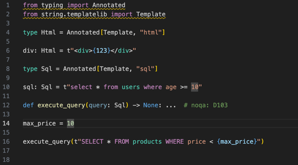

# t-linter 🐍✨

Intelligent syntax highlighting and validation for Python template strings (PEP 750).

[](https://opensource.org/licenses/MIT)
[](https://marketplace.visualstudio.com/items?itemName=koxudaxi.t-linter)
[](https://pypi.org/project/t-linter/)

## Overview

t-linter provides intelligent syntax highlighting and linting for Python template strings (PEP 750) through multiple distribution channels:

- **🔧 Command-line tool**: Install via PyPI (`pip install t-linter`) for direct CLI usage and LSP server
- **🎨 VSCode Extension**: Install from the Visual Studio Code Marketplace for seamless editor integration



## Features

- 🎨 **Smart Syntax Highlighting** - Detects embedded languages in `t"..."` strings
- 🔍 **Type-based Detection** - Understands `Annotated[Template, "html"]` annotations
- 🚀 **Fast** - Built with Rust and Tree-sitter for optimal performance
- 🔧 **Extensible** - Support for HTML, SQL, JavaScript, CSS, and more

## Installation

### Option 1: VSCode Extension (Recommended for VSCode users)

**Step 1: Install the t-linter binary**
First, install the language server via PyPI:
```bash
pip install t-linter
```

**Step 2: Install the VSCode extension**
Install the extension from the Visual Studio Code Marketplace:

1. Open VSCode
2. Go to Extensions (Ctrl+Shift+X / Cmd+Shift+X)
3. Search for "t-linter"
4. Click Install on "T-Linter - Python Template Strings Highlighter & Linter" by koxudaxi

**Step 3: Configure the server path (if needed)**
If t-linter is not in your PATH, configure the server path in VSCode settings:

1. **Find your t-linter path** by running in terminal:
   ```bash
   which t-linter     # macOS/Linux
   where t-linter     # Windows
   ```

2. Open VSCode Settings (Ctrl+, / Cmd+,)
3. Search for "t-linter.serverPath"
4. Set the full path to your t-linter executable:
   - **Windows**: `C:\Users\YourName\AppData\Local\Programs\Python\Python3xx\Scripts\t-linter.exe`
   - **macOS**: `/opt/homebrew/bin/t-linter` or `/usr/local/bin/t-linter`
   - **Linux**: `/home/yourname/.local/bin/t-linter` or `/usr/local/bin/t-linter`

**[→ Install from VSCode Marketplace](https://marketplace.visualstudio.com/items?itemName=koxudaxi.t-linter)**

### Option 2: PyPI Package Only (CLI tool and LSP server)

For command-line usage or integration with other editors, install only the PyPI package:

```bash
pip install t-linter
```

This provides the `t-linter` command-line tool and LSP server without the VSCode extension.

**[→ View on PyPI](https://pypi.org/project/t-linter/)**

### Option 3: Build from Source

For development or bleeding-edge features:

```bash
git clone https://github.com/koxudaxi/t-linter
cd t-linter
cargo install --path crates/t-linter
```

## Usage

### VSCode Extension
After installing both the PyPI package and VSCode extension, t-linter will automatically provide syntax highlighting for Python template strings. 

**Troubleshooting**: If syntax highlighting doesn't work:
1. Ensure `t-linter` is installed: Run `t-linter --version` in terminal
2. Check the server path in VSCode settings: `t-linter.serverPath`
3. Restart VSCode after making changes

### Command Line Interface
If you installed via PyPI, you can use t-linter from the command line:

**Run the language server** (for editor integration):
```bash
t-linter lsp
```

**Check individual files**:
```bash
t-linter check file.py
```

**Get statistics** about template strings in a file:
```bash
t-linter stats file.py
```

## Quick Start Example

Here's how to use template strings with automatic syntax highlighting:

```python
from typing import Annotated
from string.templatelib import Template

# HTML template with syntax highlighting
page: Annotated[Template, "html"] = t"""
<!DOCTYPE html>
<html>
    <head>
        <title>{title}</title>
        <style>
            body { font-family: Arial, sans-serif; }
            .highlight { color: #007acc; }
        </style>
    </head>
    <body>
        <h1 class="highlight">{heading}</h1>
        <p>{content}</p>
    </body>
</html>
"""

# SQL query with syntax highlighting
query: Annotated[Template, "sql"] = t"""
SELECT u.name, u.email, p.title 
FROM users u 
JOIN posts p ON u.id = p.author_id 
WHERE u.created_at > {start_date}
ORDER BY u.name
"""

# Type aliases for reusable templates (Python 3.12+)
type css = Annotated[Template, "css"]
type js = Annotated[Template, "javascript"]

styles: css = t"""
.container {
    max-width: 1200px;
    margin: 0 auto;
    padding: {padding}px;
}
"""
```

