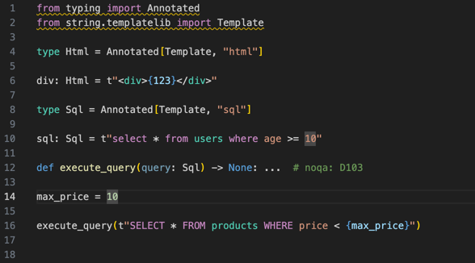

# T-Linter for Visual Studio Code

Intelligent syntax highlighting and validation for Python template strings (PEP 750) with embedded language support.



## Features

- 🎨 **Smart Syntax Highlighting** - Automatic detection and highlighting of embedded languages
- 🔍 **Type-based Detection** - Understands `Annotated[Template, "language"]` annotations
- 💡 **IntelliSense Support** - Code completion within template strings
- 🚀 **Fast & Lightweight** - Built with Rust for optimal performance
- 🔧 **Highly Configurable** - Customize behavior to match your workflow

### Supported Languages
- HTML
- SQL
- JavaScript
- CSS
- JSON

## Requirements

- Visual Studio Code 1.74.0 or higher
- Python 3.9+ (PEP 750 template strings require Python 3.14+)
- `t-linter` language server (must be installed via PyPI)

## Installation

**⚠️ Important**: This extension requires the t-linter language server to be installed separately.

### Step 1: Install the t-linter language server
Install t-linter as a project dependency (recommended):
```bash
pip install t-linter
```

For better project isolation, add it to your project's requirements:
```bash
# Add to requirements.txt
echo "t-linter" >> requirements.txt
pip install -r requirements.txt

# Or add to pyproject.toml
[project]
dependencies = [
    "t-linter",
    # other dependencies...
]
```

### Step 2: Install the VSCode extension
1. Open VSCode
2. Go to Extensions (Ctrl+Shift+X)
3. Search for "t-linter"
4. Click Install on "T-Linter - Python Template Strings Highlighter & Linter" by koxudaxi

### Step 3: Disable Python Language Server
To prevent conflicts with t-linter's syntax highlighting, you need to disable the Python language server:

1. Open VSCode Settings (Ctrl+, / Cmd+,)
2. Search for "python.languageServer"
3. Set it to "None"

Alternatively, add to your settings.json:
```json
{
    "python.languageServer": "None"
}
```

[Learn more about Python language server settings](https://code.visualstudio.com/docs/python/settings-reference#_intellisense-engine-settings)

### Step 4: Configure server path (if needed)
If the extension can't find the t-linter binary automatically:

1. **Find your t-linter path**:
   ```bash
   which t-linter     # macOS/Linux
   where t-linter     # Windows
   ```

2. **Set the path in VSCode settings**:
   - Open Settings (Ctrl+, / Cmd+,)
   - Search for `t-linter.serverPath`
   - Enter the full path to your t-linter executable

### Optional: PEP 750 Support with Patched Pyright

Since PEP 750 template strings (`t"..."`) are not yet supported in the official Pyright extension, you can install a patched version that adds PEP 750 t-string support:

1. **Download the patched Pyright extension**:
   - Go to [Patched Pyright Releases](https://github.com/koxudaxi/pyright/releases/tag/untagged-7b5f847f7a434b72a328)
   - Download the `.vsix` file

2. **Install the patched extension**:
   - Open VSCode
   - Press `Ctrl+Shift+P` (Cmd+Shift+P on macOS)
   - Type "Extensions: Install from VSIX..."
   - Select the downloaded `.vsix` file

3. **Disable the original Pyright extension** (if installed):
   - Go to Extensions tab
   - Find "Pyright" and click "Disable"

This patched version enables Pyright to recognize and type-check PEP 750 template strings, providing better integration with t-linter for comprehensive template string analysis.

## Usage

### Basic Example
```python
from typing import Annotated
from string.templatelib import Template

# Automatic HTML syntax highlighting
def render_page(content: Annotated[Template, "html"]) -> str:
    return content.render()

page = t"""
<!DOCTYPE html>
<html>
    <body>
        <h1>{title}</h1>
        <p>{content}</p>
    </body>
</html>
"""

# SQL highlighting
query: Annotated[Template, "sql"] = t"SELECT * FROM users WHERE id = {user_id}"
```

### Type Alias Support (Python 3.12+)
```python
# Define reusable type aliases
type html = Annotated[Template, "html"]
type sql = Annotated[Template, "sql"]

# Use with automatic language detection
content: html = t"<div>{message}</div>"
db_query: sql = t"UPDATE users SET name = {name} WHERE id = {id}"
```

### Function Parameter Inference
```python
def execute_query(query: sql) -> list:
    return db.execute(query)

# Language inferred from function parameter type
execute_query(t"SELECT * FROM products WHERE price < {max_price}")
```

## Configuration

This extension contributes the following settings:

- **`t-linter.enabled`**: Enable/disable the t-linter extension
- **`t-linter.serverPath`**: Path to t-linter executable (leave empty for automatic detection)
- **`t-linter.highlightUntyped`**: Highlight template strings without type annotations (default: true)
- **`t-linter.enableTypeChecking`**: Enable integration with Python type checkers for cross-module resolution (default: true)
- **`t-linter.trace.server`**: Trace communication between VSCode and the language server (off/messages/verbose)

## Commands

This extension contributes the following commands:

- **`T-Linter: Restart Server`**: Restart the t-linter language server
- **`T-Linter: Show Template String Statistics`**: Display statistics about template strings in the current file

## Troubleshooting

### Language server not found
If you see "t-linter binary not found":

1. **Ensure t-linter is installed in your project**:
   ```bash
   pip install t-linter
   # Or if using requirements.txt:
   pip install -r requirements.txt
   ```

2. **Verify installation**:
   ```bash
   t-linter --version
   ```

3. **Configure server path manually**:
   - Find the path: `which t-linter` (macOS/Linux) or `where t-linter` (Windows)
   - Common installation paths:
     - **Windows**: `C:\Users\YourName\AppData\Local\Programs\Python\Python3xx\Scripts\t-linter.exe`
     - **macOS**: `/Users/yourname/.local/bin/t-linter` or `/usr/local/bin/t-linter`
     - **Linux**: `/home/yourname/.local/bin/t-linter` or `/usr/local/bin/t-linter`
   - Set `t-linter.serverPath` in VSCode settings
   - Restart VSCode

### No syntax highlighting
1. Ensure both the PyPI package AND VSCode extension are installed
2. **Verify that Python language server is disabled**: `python.languageServer` should be set to "None"
3. Check that Python semantic highlighting is enabled in VSCode
4. Verify your template strings use the `t"..."` syntax
5. Ensure type annotations are correctly formatted
6. Try restarting the language server: `Ctrl+Shift+P` → "T-Linter: Restart Server"

### Performance issues
- Disable `t-linter.enableTypeChecking` if you don't need cross-module type resolution
- Set `t-linter.trace.server` to "off" in production
- Restart VSCode after changing settings

## Known Issues

- Cross-module type resolution requires a Python type checker (Pyright/Pylsp) to be installed
- Limited to single-file analysis scope in the current version

## Contributing

Found a bug or have a feature request? Please open an issue on our [GitHub repository](https://github.com/koxudaxi/t-linter/issues).

## License

MIT - See [LICENSE](https://github.com/koxudaxi/t-linter/blob/main/LICENSE) for details.